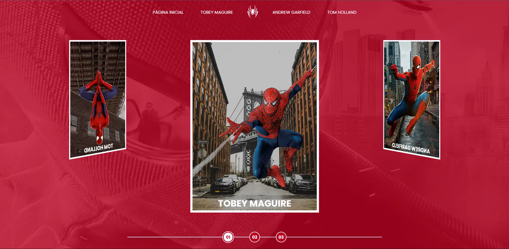

<h1 align="center"> Spider-man Multiverse </h1>

  <a href="#-tecnologias">Tecnologias</a>&nbsp;&nbsp;&nbsp;|&nbsp;&nbsp;&nbsp;
  <a href="#-projeto">Projeto</a>&nbsp;&nbsp;&nbsp;

 

  

## 💻 Projeto

Spider-man Multiverse teve início durante uma live code da DIO, adicionei personalizações como uma galeria e layout interno feito com display grid.

- [Acesse o projeto finalizado](https://gabtech1.github.io/Multiverse-spider/)

## 🚀 Tecnologias

Esse projeto foi desenvolvido com as seguintes tecnologias:

- HTML e CSS
- JavaScript
- Git e Github
 
 

:wave: